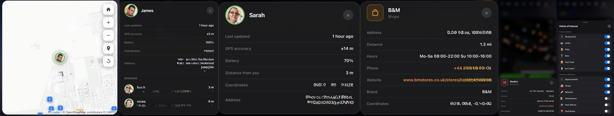

# Meerkat Map Card

Track a person entity on a live OpenStreetMap with an animated pulsing marker, points of interest, distance calculations, full address lookup, and shared location tracking — all from a single Lovelace card.

## Person tracking

The person marker is colour-coded by zone — green when home, orange when away. Tap it to open a popup showing last updated time, GPS accuracy, battery, coordinates, and full address.

## Sharing

Add any entity with GPS coordinates to the map alongside yourself — people, device trackers, phones, cars, or anything else Home Assistant can locate. Each shared entity appears as its own pulsing marker, colour-coded by zone status.

Tap your own marker to see a **Sharing** section listing all tracked entities with their current address and distance from you. Tap any row to close the popup and fly the map directly to that entity's location.

Tap a tracked entity's marker directly to see its own popup with last updated time, GPS accuracy, battery, distance from you, coordinates, and a reverse-geocoded address.

Configure shared entities in the **Sharing** section of the visual editor — it lists all entities with GPS coordinates and lets you toggle them on with a search filter to find them quickly.

## POI quick-select

Tap the map pin button in the top-right controls to open a bottom sheet where you can toggle any of the 53 POI categories directly on the map — no need to open the editor. Changes take effect immediately and are saved to your dashboard configuration.

## Points of interest

53 POI categories across 8 groups, toggled individually in the visual editor. Data is fetched from OpenStreetMap via Overpass API and cached locally using IndexedDB. All POIs fetched across every area you visit are accumulated and kept — panning or zooming never causes previously loaded markers to disappear. Returning to any visited location — including reopening the app or navigating away and back — restores all markers instantly from cache with no network request.

POIs are only fetched and displayed when zoomed in to level 13 or above. A notice appears on the map when you are zoomed out too far, and cached markers are hidden until you zoom back in.

> **Note:** Enable only a small number of categories at once, especially on mobile. A small selection of the most useful categories works best.

**Enabled by default:** Train Stations, Bus Stops, Hospitals, Pharmacies, Supermarkets.

Tap any POI marker to see its name, category, address, opening hours, phone (tap to call — a confirmation sheet appears before dialling), website, distance from the tracked person, and any available extra details such as cuisine, wheelchair access, fees, operator, brand, network, and coordinates.

## POI status ring

A small ring beneath the map controls in the top-right corner shows the current loading state at all times. It breathes yellow while fetching, pulses green on success, and fades from red back to white on failure. The centre button stops an active fetch or opens a confirmation prompt to clear all cached POI data and download fresh information from OpenStreetMap.

## iPhone and iPad

The iOS companion app blocks direct requests to external APIs, which prevents points of interest from loading. To fix this, install the free **Home Assistant Web Proxy** integration via HACS (Integrations), then add the following three URL patterns in its configuration:

- `https://overpass-api.de/*`
- `https://overpass.kumi.systems/*`
- `https://maps.mail.ru/*`

The card always tries the proxy first — it routes requests through your HA server, making them same-origin and safe on iOS. If the proxy is not installed or unreachable, the card falls back to direct connections automatically. No card configuration is needed.

See the [README](README.md) for full setup steps.

## Cache settings

The visual editor includes a Cache Settings section where you can:

- Set the **cache duration** — how long POI data is kept before being considered stale. Options range from 6 hours to 12 months. The default of 48 hours is recommended, as POIs like bus stops and hospitals change very rarely.
- **Clear all cached data** — removes all saved POI data from the device immediately. The current cache size is shown directly below the button so you can see how much is stored before clearing.

## Visual editor

All settings are configurable through the built-in visual editor — no YAML required. Options include:

- Person entity and geocoded location sensor
- Sharing — add people, devices or any GPS entity to track alongside yourself
- Map height and default zoom level
- Dark / Light / Auto theme
- Distance units (km/m, mi/m, or mi/yd)
- POI icon size (Small / Medium / Large)
- Person icon size (Small / Medium / Large)
- Cache duration, cache size display, and clear cache button
- 53 POI category toggles organised into 8 groups (also accessible via the map pin button on the map)

## Compatibility

Works on desktop browsers and the iOS/Android Home Assistant companion app. iPhone and iPad require the Home Assistant Web Proxy integration for POI loading (see above).
